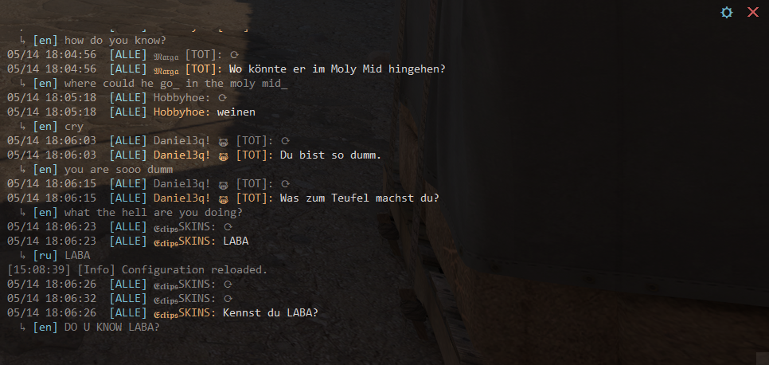
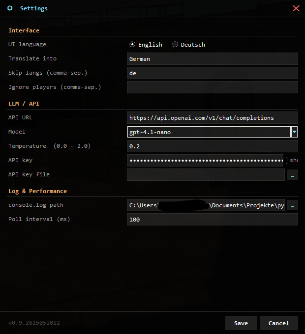

# CounterTranslate

Transparent overlay for CS2 that automatically translates chat messages in real time — directly on your screen, without touching the game process at all.



---

## What is CounterTranslate?

When enemies or teammates write in Russian, Romanian, Chinese, or any other language, the translation appears immediately as a semi-transparent overlay — without alt-tabbing, copy-pasting, or opening a separate window.

- All languages are detected and translated automatically
- Transparent overlay, always on top
- Your own language is never translated (default: German)
- Specific players can be ignored
- Configurable translation target language and skip list
- Auto-updates on startup (compiled build only)

---

## Is this safe? Will I get banned?

**No — there is no risk of a ban.**

CounterTranslate only reads the `console.log` file that CS2 writes by itself. It does **not** attach to the game process, modify game mechanics, inject any code, or communicate with CS2 in any way. VAC and other anti-cheat systems only detect interference with the running process — CounterTranslate is invisible to them because it is simply a log-file reader.

---

## Requirements

- Windows 10 or 11
- CS2 via Steam
- OpenAI API key (or any OpenAI-compatible endpoint)

---

## Setup

### Step 1 — Set the Steam launch option

CS2 needs to be told to write a log file. This is a one-time launch option:

1. Open Steam → Library → right-click **Counter-Strike 2** → **Properties**
2. In the **Launch Options** field, enter:
   ```
   -condebug
   ```
3. Done — from the next CS2 launch onward the log file will be written automatically.

The file is usually located at:
```
C:\Program Files (x86)\Steam\steamapps\common\Counter-Strike Global Offensive\game\csgo\console.log
```
Adjust the path if your Steam library is on a different drive.

---

### Step 2 — Get an OpenAI API key

CounterTranslate needs an API key for translation:

1. Create an account or sign in at [platform.openai.com](https://platform.openai.com)
2. Go to **API Keys** → **Create new secret key**
3. Copy the key and keep it handy — you will enter it into CounterTranslate in a moment

> If you prefer not to use OpenAI, you can enter any OpenAI-compatible endpoint in the settings — for example a local model running in LM Studio.

---

### Step 3 — Download and launch CounterTranslate

1. Download the latest release from the [Releases page](https://github.com/Crankerer/CounterTranslate/releases)
2. Extract the ZIP
3. Launch `CounterTranslate.exe`

On **first launch**, CounterTranslate will automatically ask for:
- your **OpenAI API key**
- the path to **console.log** (select the CS2 base folder — the rest is filled in automatically)

---

## Usage

1. Start `CounterTranslate.exe` — the transparent overlay appears
2. Launch CS2 and play
3. Whenever someone writes in chat, the translation appears in the overlay

---

## Keyboard Shortcuts

| Key | Action |
|-----|--------|
| `Escape` | Close the overlay |
| `F1` | Toggle overlay visibility |
| `F2` | Cycle transparency |

The overlay can also be dragged to any position and resized using the handle in the bottom-right corner.

---

## Settings

Click the ⛭ icon in the top-right of the overlay to open the settings dialog:



| Setting | Description |
|---------|-------------|
| **UI Language** | Language of the settings interface |
| **Translate into** | Target language for translations (e.g. `German`) |
| **Skip langs** | Languages that are never translated (e.g. `de` for German) |
| **Ignore players** | Player names whose messages are skipped |
| **API URL** | Chat completions endpoint (default: OpenAI; customisable for local models) |
| **Model** | LLM model (locked to `gpt-4.1-nano` for the official OpenAI URL; free text for custom endpoints) |
| **Temperature** | LLM temperature — lower values produce more literal translations |
| **API key** | Your OpenAI API key (masked; toggle visibility with the checkbox) |
| **API key file** | Path to a text file containing the API key (used when the key field is empty) |
| **console.log path** | Path to the CS2 log file |
| **Poll interval (ms)** | How often the log file is checked for new lines |

All settings are saved immediately and take effect without restarting the app.

---

## Troubleshooting

**Nothing appears in the overlay**
- Check that `-condebug` is set as a Steam launch option
- Check that the `console.log` file exists at the configured path
- Restart CS2 once so the log file is created

**Translation errors / API errors**
- Check that the API key is entered correctly
- Check that your OpenAI account has sufficient credit
- If using a custom endpoint, make sure the model name matches what the server expects
